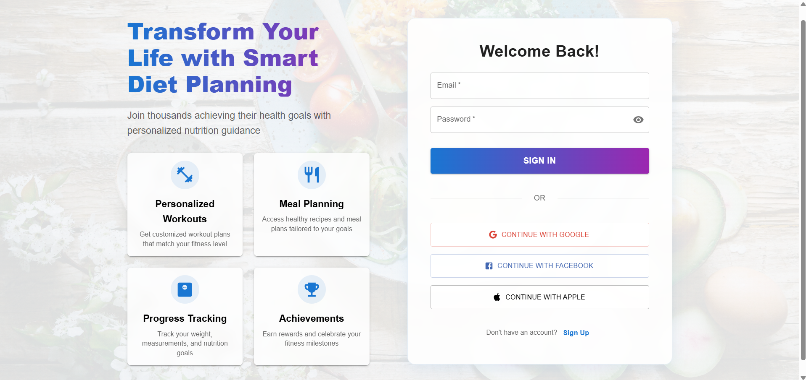
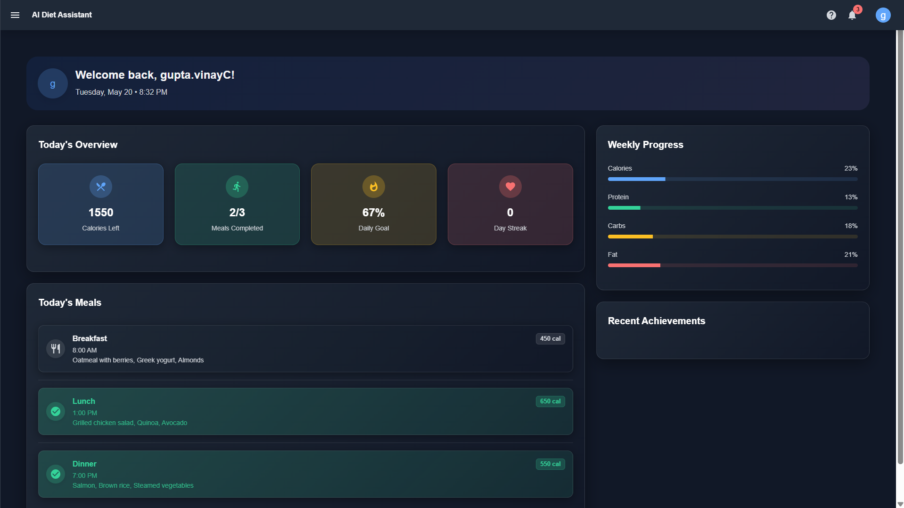
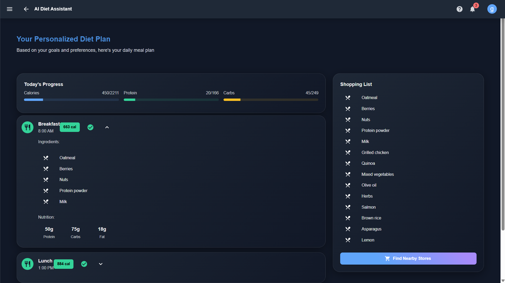
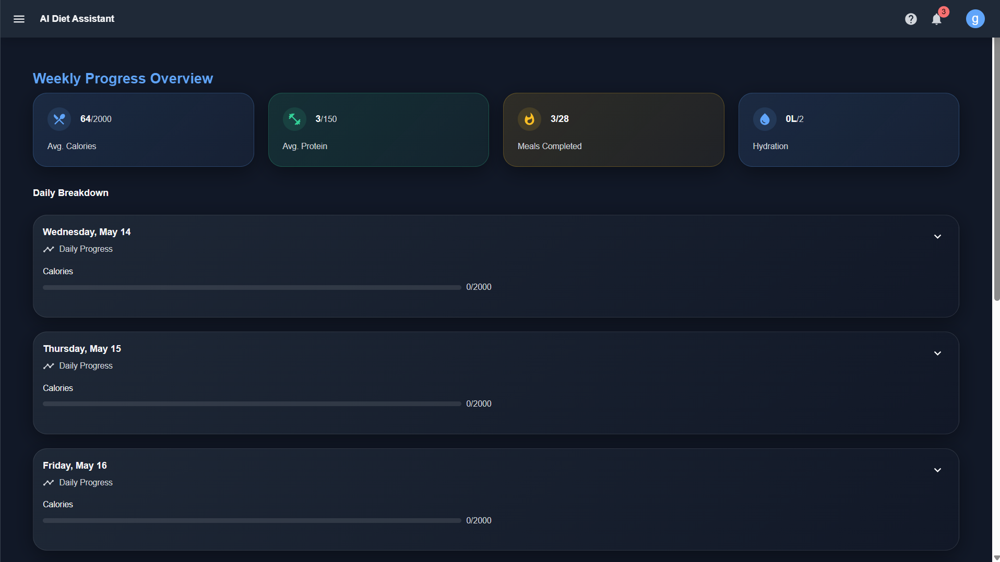
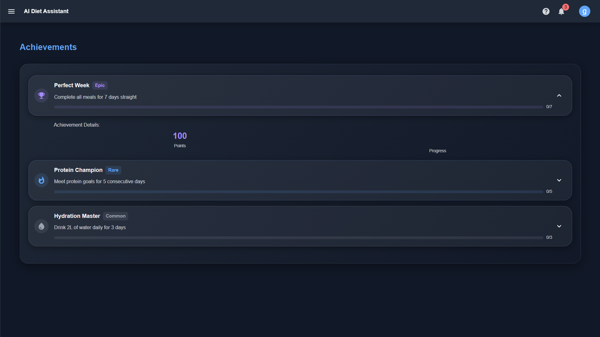
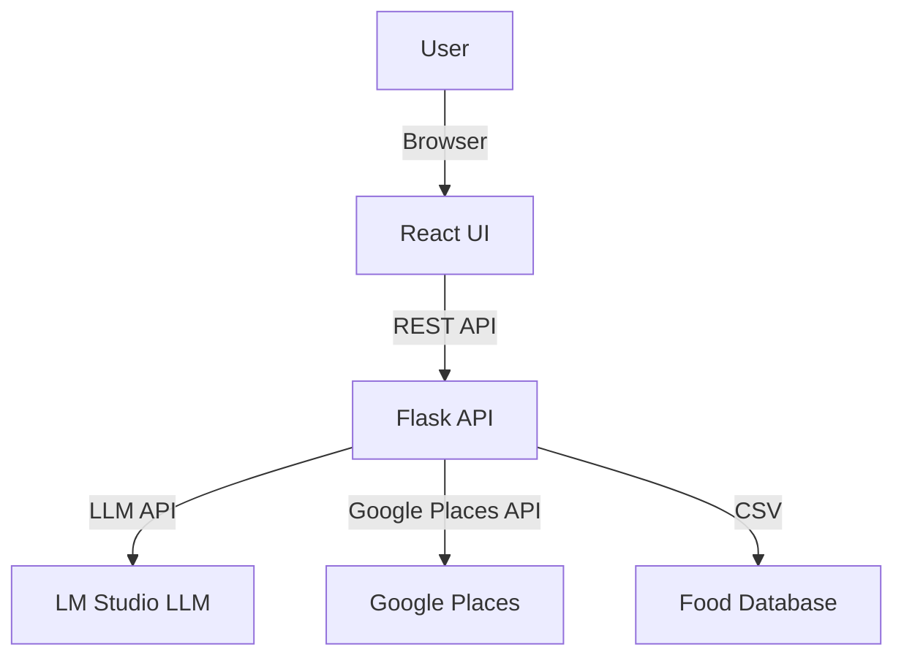

# AI Diet Assistant

Transform your health journey with a full-stack AI-powered diet and nutrition assistant. This project leverages modern web technologies and local LLMs to deliver personalized meal plans, nutrition analysis, and smart recommendations, all in a beautiful, user-friendly interface.

---

## 🚀 Project Overview
AI Diet Assistant is a full-stack application that helps users:
- Generate personalized diet plans based on their profile, restrictions, and health goals
- Get AI-powered meal suggestions and explanations (using local LLM via LM Studio)
- Find nearby healthy restaurants and grocery stores (Google Places API)
- Track progress and celebrate achievements

---

## 📸 Project Screenshots

### 1. Login & Welcome Page

*Modern, user-friendly login page with social sign-in options and a welcoming introduction.*

### 2. Dashboard Overview

*Personalized dashboard showing calories, meals, daily goals, streaks, and a summary of today's meals.*

### 3. Weekly Progress Tracking

*Track your weekly calories, protein, meals completed, and hydration with a detailed daily breakdown.*

### 4. Personalized Diet Plan

*AI-generated daily meal plan with nutrition breakdown and a smart shopping list for easy meal prep.*

### 5. Achievements & Rewards

*Gamified achievements to motivate users, including streaks, protein goals, and hydration milestones.*

---

## 🌟 Why This Project Stands Out
- **End-to-End AI Integration:** Combines classic web dev with cutting-edge local LLMs for real, practical AI use.
- **Privacy-First:** All AI runs locally—no user data leaves your machine.
- **Modular & Extensible:** Clean, well-organized codebase makes it easy to add new features or swap components.
- **Real-World Relevance:** Tackles a meaningful problem—personalized health and nutrition.
- **Modern Stack:** Uses the latest in React, TypeScript, Flask, and AI APIs.
- **Beautiful UI:** Professional, responsive design with Material UI.
- **Open Source Spirit:** Built for learning, sharing, and community improvement.

---

## 🤝 For Developers: How to Contribute & Learn
- **Explore Modular Code:** Each feature (diet, nutrition, LLM, places) is in its own module for clarity.
- **Add Your Own AI Models:** Swap in any OpenAI-compatible LLM in LM Studio—experiment with prompts and outputs!
- **Improve the UI/UX:** The React frontend is easy to extend with new pages, themes, or components.
- **API-First Design:** All business logic is exposed via RESTful APIs—perfect for mobile or other frontends.
- **Learn Best Practices:** See examples of environment config, error handling, and scalable project structure.
- **Contribute:** Fork, branch, and PR! Suggestions, bugfixes, and new features are welcome.
- **Great for Portfolios:** Use this as a template or inspiration for your own AI-powered apps.

---

## ✨ Features
- **User Profile Management**: Age, gender, weight, height, activity, restrictions, health conditions
- **Personalized Diet Generation**: Smart meal plans tailored to user needs
- **AI Meal Suggestions**: Detailed, context-aware meal ideas from a local LLM
- **Nutrition Analysis**: Macro/micro breakdown for each plan
- **Nearby Restaurants & Stores**: Find healthy options near you (Google Places API)
- **Progress Tracking & Achievements**: Visualize and celebrate your health journey
- **Modern UI/UX**: Responsive, clean React interface with Material UI

---

## 🛠️ Tech Stack
- **Frontend**: React, TypeScript, Material UI, Axios
- **Backend**: Flask, Flask-CORS, Python, Pandas, Requests
- **AI/LLM**: LM Studio (OpenAI-compatible local server), Phi 3.1 Mini 128k Instruct (recommended)
- **Data**: CSV-based food database
- **APIs**: Google Places (for restaurants/stores)

---

## 🏗️ Architecture


---

## ⚡ Quickstart

### 1. Clone the Repository
```bash
git clone https://github.com/yourusername/ai-diet-assistant.git
cd ai-diet-assistant
```

### 2. Backend Setup
```bash
# Create and activate a virtual environment
python -m venv venv
./venv/Scripts/activate  # On Windows
# Install dependencies
pip install -r requirements.txt
# Add your .env file (see below)
```

#### .env Example
```
GOOGLE_PLACES_API_KEY=your_google_api_key_here
FLASK_ENV=development
FLASK_DEBUG=1
```

### 3. Frontend Setup
```bash
cd src/frontend/diet-assistant-ui
npm install
# (Optional) Add .env for API URL
# echo REACT_APP_API_URL=http://localhost:5000 > .env
npm start
```

### 4. LLM (LM Studio) Setup
- Download and install [LM Studio](https://lmstudio.ai/)
- Download the model: **Phi 3.1 Mini 128k Instruct** (IQ3_M or Q4_K_M recommended)
- Start LM Studio and load the model
- Ensure the OpenAI-compatible API server is running at `http://127.0.0.1:1234`

---

## 🧑‍💻 Usage
- Open [http://localhost:3000](http://localhost:3000) in your browser
- Sign up or log in (UI only, no real authentication)
- Enter your profile details and generate a personalized diet plan
- Explore meal suggestions, nutrition breakdown, and local healthy options

---

## 🔧 Customization & Extensibility
- **Add more foods**: Edit `data/food_database.csv`
- **Change LLM prompts**: Edit `src/llm_integration.py`
- **Swap LLM models**: Use any OpenAI-compatible model in LM Studio
- **Add authentication**: Integrate with Firebase/Auth0 or Flask-Login
- **Deploy**: Use Heroku, Vercel, or your preferred cloud provider

---

## 🩺 Troubleshooting
- **LLM not responding?**
  - Ensure LM Studio is running and model is loaded
  - Check that the model name in `src/llm_integration.py` matches LM Studio
  - Make sure the API URL is `http://127.0.0.1:1234/v1/chat/completions`
- **Google Places not working?**
  - Add a valid API key to your `.env` file
  - Check backend logs for errors
- **Frontend/backend connection issues?**
  - Ensure both servers are running
  - Check CORS settings in Flask

---

## 🙏 Credits
- [LM Studio](https://lmstudio.ai/) for local LLM serving
- [Phi 3.1 Mini](https://huggingface.co/microsoft/Phi-3-mini-128k-instruct) for the model
- [Material UI](https://mui.com/) for UI components
- [Google Places API](https://developers.google.com/maps/documentation/places/web-service/overview)

---

## 📄 License
This project is licensed under the MIT License. See [LICENSE](LICENSE) for details.
